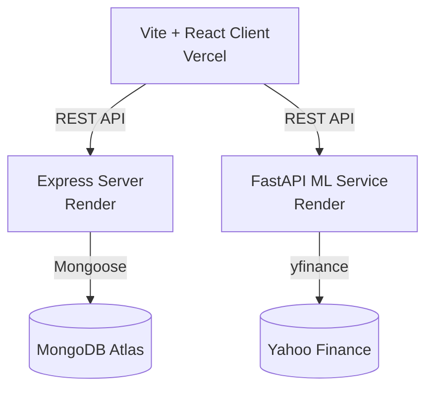

# Stock Predictor

A full-stack application predicting next-day close prices for NIFTY 50 stocks using Machine Learning.

**Note:** The backend services are hosted on Render's free tier. They may spin down after 15 minutes of inactivity. When you first open the app, the initial request might take ~30-50 seconds as the servers wake up.

## Live Demo (Placeholders)
- **Client App:** https://stock-predictor-demo.vercel.app
- **Express API:** https://stock-predictor-server.onrender.com
- **ML API:** https://stock-predictor-ml.onrender.com

## Architecture

## Features
- Search any NIFTY 50 stock and view historical actual vs predicted prices.
- Dynamic Next-Day Predicted Price with Model Accuracy (MAE, RMSE, R²).
- Personal Watchlist for quick access.
- Compare multiple stocks on a single chart (% change).
- Export data to CSV.

## Tech Stack
- **Frontend:** React, Vite, Recharts, Axios
- **Backend:** Node.js, Express, MongoDB
- **ML Service:** Python, FastAPI, Scikit-learn (Linear Regression), Pandas, yfinance

## Environment Variables
### Server (Node)
| Variable | Description |
|---|---|
| PORT | Port to run on (e.g., 5000) |
| MONGO_URI | MongoDB Atlas connection string |
| JWT_SECRET | Secret string for signing cookies |
| CORS_ORIGIN | URL of the client app (e.g., https://client.vercel.app) |
| NODE_ENV | Set to 'production' for deployments |

### ML Service (Python)
| Variable | Description |
|---|---|
| PORT | Port (provided by Render) |
| CLIENT_URL | URL of the client app for CORS |

### Client (React)
| Variable | Description |
|---|---|
| VITE_API_URL | Express API URL |
| VITE_ML_URL | FastAPI ML Service URL |

## Screenshots
*(Add screenshots of your dashboard here!)*